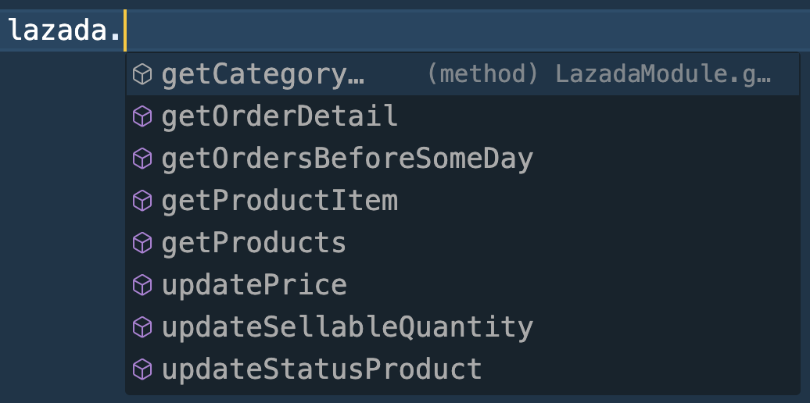

## ⚡️ Installation

- **npm**: `npm i shopee-tiktokshops-lazada-api`
- **yarn**: `yarn add shopee-tiktokshops-lazada-api`

## TIKTOK MODULE (UPDATE API V2 VERSION 2309)

```
  const tiktok = new TiktokModule({
  appKey: '1234567890',
  appSecret: '1234567890',
  shopId: '1234567890',
  shopCipher: '1234567890',
  accessToken: '1234567890',
});
```


## SHOPEE MODULE

```
  const shopee = new ShopeeModule({
  partnerId: 1234567890,
  partnerKey: '1234567890',
  shopId: '1234567890',
  accessToken: '1234567890',
});
```


## Lazada MODULE

```
  const lazada = new LazadaModule({
  appKey: '1234567890',
  appSecret: '1234567890',
  shopId: '1234567890',
  appAccessToken: '1234567890',
});
```



## Contact

```
Mail: phamkhanhminhman97@gmail.com
Skype: phamkhanhminhman97@gmail.com
```

## To be continued...# shopee-tiktok-lazada-api

# shopee-tiktok-lazada-api
