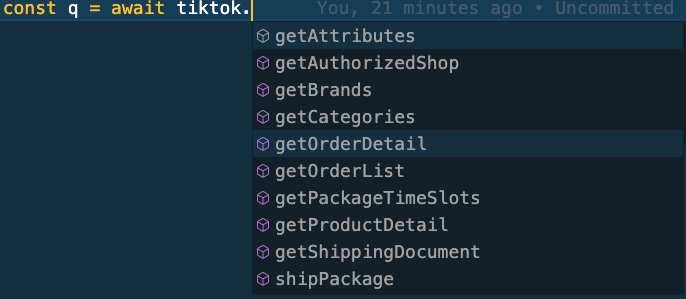

## ⚡️ Installation

- **npm**: `npm i shopee-tiktokshops-lazada-api`
- **yarn**: `yarn add shopee-tiktokshops-lazada-api`

## TIKTOK MODULE (UPDATE API V2 VERSION 2309)

```
  const tiktok = new TiktokModule({
  appKey: '1234567890',
  appSecret: '1234567890',
  shopId: '1234567890',
  shopCipher: '1234567890',
  accessToken: '1234567890',
});
```

| Function            | Status |
| ------------------- | ------ |
| getOrderList        | Doing  |
| getOrderDetail      | Done   |
| getProductDetail    | Done   |
| getAuthorizedShop   | Done   |
| getPackageTimeSlots | Done   |
| shipPackage         | Done   |
| getShippingDocument | Done   |
| getCategories       | Done   |
| getBrands           | Done   |
| getAttributes       | Done   |
| createProduct       | Done   |



## SHOPEE MODULE

```
  const shopee = new ShopeeModule({
  partnerId: 1234567890,
  partnerKey: '1234567890',
  shopId: '1234567890',
  accessToken: '1234567890',
});
```

| Function               | Status |
| ---------------------- | ------ |
| getOrders              | Doing  |
| getOrderDetail         | Done   |
| getProductItemList     | Done   |
| getProductItemBaseInfo | Done   |
| updateStock            | Done   |
| unListItem             | Done   |
| updatePrice            | Done   |
| addItem                | Done   |
| getChannelList         | Done   |
| fetchToken             | Done   |
| getCategory            | Done   |
| getAttributes          | Done   |
| getBrandList           | Done   |
| shippingParameter      | Done   |
| shipOrder              | Done   |


## Lazada MODULE

```
  const lazada = new LazadaModule({
  appKey: '1234567890',
  appSecret: '1234567890',
  shopId: '1234567890',
  appAccessToken: '1234567890',
});
```


## Contact

```
Mail: phamkhanhminhman97@gmail.com
Skype: phamkhanhminhman97@gmail.com
```

## To be continued...# shopee-tiktok-lazada-api

# shopee-tiktok-lazada-api
